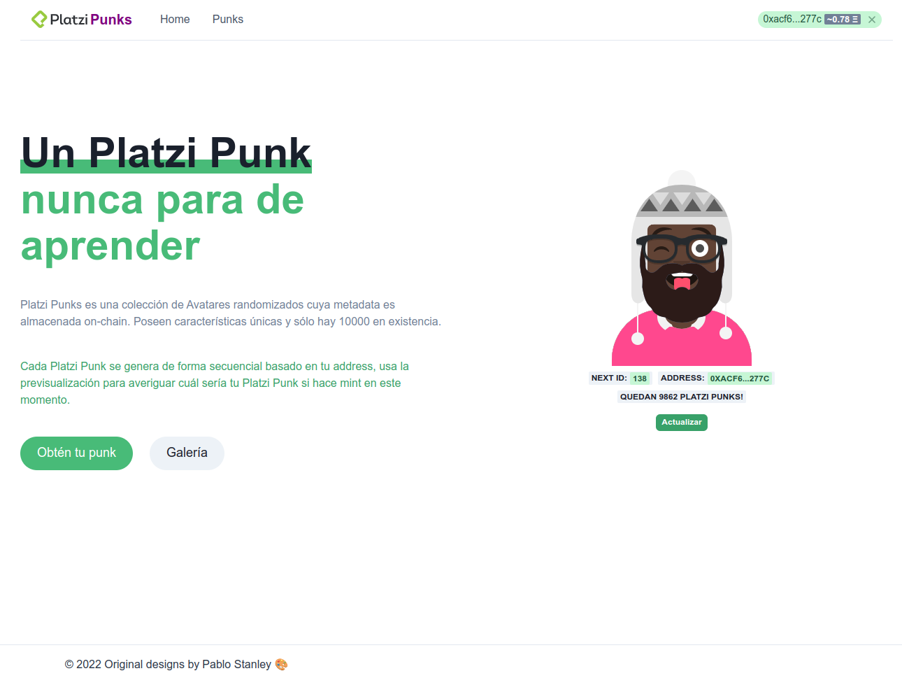
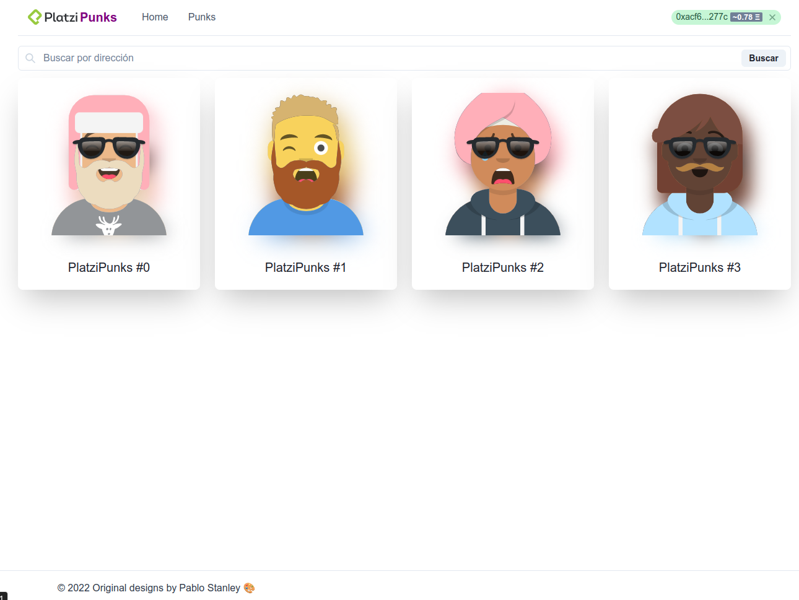
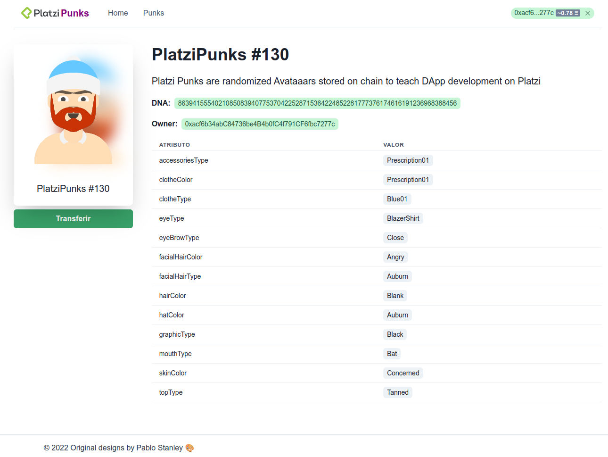

# PlatziPunks Interface

PlatziPunks interface is a web app in that you can mint, visualize and transfer Not Fungible Tokens (NFT) from the contracts [PlatziPunks](https://github.com/bjvalmaseda92/platzi-punks) . It was create like final Project of the Frontend for Dapp course in [Platzi](https://platzi.com).

## Content Table
  - [Demo](#demo)
  - [Features](#features)
  - [Installation steps](#installation-steps)
  - [The building process](#the-building-process)
    - [Built with](#built-with)
  - [Useful resources](#useful-resources)
  - [License](#license)
  - [Author](#author)

## Demo
You can find a demo in https://blue-rain-4468.on.fleek.co/ or use this hash *QmaVcPtkAzDMGbSQonjoKzQe5y3jNGTS7kQ5DT1PWtNHXQ* to [IPFS](https://en.wikipedia.org/wiki/InterPlanetary_File_System) network. 





## Features

- Mint a NFT
- Vizualise all NFT in the collection (Contract)
- Filters NFT by wallets address
- Transfer NFT to others accounts

## Installation steps

If you like run your own demo follow this steps

1. Clone this repository
   ```sh
   $ git clone https://github.com/bjvalmaseda92/platzi-punks.git
   ```
2. Run npm install inside folder repo
   ```sh
   $ npm install
   ```
3. Run npm start to run a local server
   ```sh
   $ npm start
   ```

## The building process
 ### Built with
- [Create React App](https://create-react-app.dev/)
- [Web3.js](https://web3js.readthedocs.io/)
- [Chakra UI](https://chakra-ui.com/)

## Useful resources
- [Fleek](https://fleek.co/): Deploy to IPFS or the Internet Computer in Seconds

## License

## Author

Made by [@bjvalmaseda](https://www.twitter.com/bjvalmaseda)

